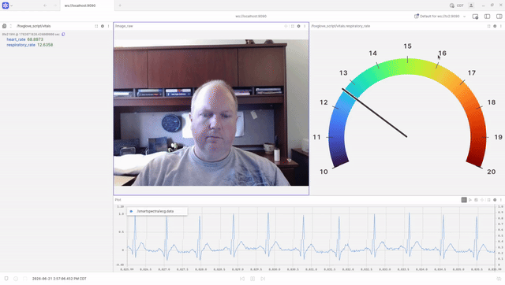

# ROS 2 SmartSpectra [](https://github.com/frankjoshua/docker-ros2-smartspectra/actions) [](https://hub.docker.com/r/frankjoshua/ros2-smartspectra)

A ROS 2 node that streams `/image_raw` camera frames into the [Presage SmartSpectra](https://physiology.presagetech.com)
SDK and publishes contactless vitals — breathing rate, plus cardiac metrics if enabled — as JSON on
`/smartspectra/metrics`. Ships as a VS Code dev container to work in and a multi-architecture image to
deploy on a robot, both built from one multi-stage `Dockerfile`, so what you develop is what you ship.

<p align="center">
  
</p>

## How it works

One `Dockerfile`, three stages, all `FROM frankjoshua/ros2:lyrical`:

- **`base`** — shared dependencies. Add every extra apt/pip package here so dev and deploy can't
  drift apart.
- **`dev`** — `base` + the image's non-root `ubuntu` user (with passwordless sudo) + an interactive shell. This is what VS Code opens. Your
  workspace is bind-mounted (not copied) and you build it inside the container.
- **`prod`** — `base` + your `src/` copied in and `colcon build`-ed, with an entrypoint that runs the
  SmartSpectra node. This is what `build.sh` / CI publish.

```
.
├── .devcontainer/devcontainer.json   # opens the dev stage
├── Dockerfile                        # base / dev / prod
├── build.sh                          # multi-arch build + push (prod stage)
├── ros_entrypoint.sh                 # sources ROS + workspace for the prod image
├── unlock_keyring.sh                 # headless Secret Service for the SmartSpectra SDK (see below)
├── .env.example                      # copy to .env and add your SMARTSPECTRA_API_KEY
└── src/                              # colcon packages (repo root is the workspace)
    └── smartspectra/                 # the camera -> vitals node
```

## Develop

1. Install Docker, VS Code, and the **Dev Containers** extension.
2. Open this folder in VS Code.
3. `Ctrl+Shift+P` → **Dev Containers: Reopen in Container**. The first build pulls the base image.
4. Put your SmartSpectra key in `.env` (copy `.env.example`) — it reaches the node as
   `$SMARTSPECTRA_API_KEY` via `--env-file` in `devcontainer.json`.
5. Open a terminal — ROS is already sourced. Build, run the node, and watch the vitals:
   ```
   colcon build --symlink-install
   source install/setup.bash   # or open a new terminal — the workspace overlay auto-sources
   ros2 run smartspectra smartspectra      # subscribes /image_raw, publishes /smartspectra/metrics
   ros2 topic echo /smartspectra/metrics   # in another terminal, with a face in frame
   ```

The repo root is the colcon workspace (`/home/ws` in the container), so `build/`, `install/`, and
`log/` appear here and are git-ignored. The container runs as the non-root **`ubuntu`** user, which
is already in the `dialout`/`video`/`plugdev` groups — handy for serial devices and cameras.

## Multiple nodes & local-network discovery

Nodes can talk to each other — on this machine or across your LAN — out of the box. The dev
container (`.devcontainer/devcontainer.json`) sets:

- **`--net=host --ipc=host --pid=host`** (`runArgs`): host networking for LAN discovery; shared
  memory for same-host transport (**`--ipc=host` is required** — without a shared `/dev/shm`, Fast
  DDS instances silently fail to connect); and unique DDS GUIDs across containers.
- **`ROS_AUTOMATIC_DISCOVERY_RANGE=SUBNET`** (`containerEnv`): discover nodes anywhere on the local
  subnet, not just this host. Use `LOCALHOST` to restrict discovery to this machine.
- **`ROS_DOMAIN_ID=0`** (`containerEnv`): only nodes sharing this ID discover each other. Give each
  project/person a unique ID to stay isolated on a shared LAN.

### Quick pub/sub test

In two terminals — same container, two containers, or two machines on the LAN:

```
# A — publisher
ros2 topic pub /chatter std_msgs/msg/String "{data: hello}"

# B — subscriber
ros2 topic echo /chatter
```

`ros2 topic list` and `ros2 node list` should show the other side. Launch another instance as its
own container with the same flags:

```
docker run -it --net=host --ipc=host --pid=host frankjoshua/ros2-smartspectra
```

> **Multicast:** `SUBNET` discovery uses multicast — reliable on wired LANs, but some Wi-Fi/cloud
> networks block it. If two machines can't discover each other there, run a Fast DDS Discovery
> Server and point nodes at it with `ROS_DISCOVERY_SERVER=<host-ip>:11811`.

## Deploy (build & publish a multi-arch image)

`build.sh` builds the `prod` stage for amd64 + arm64 with `docker buildx`.

Local single-arch build:
```
./build.sh -t frankjoshua/ros2-smartspectra -l
```

Multi-arch build and push to Docker Hub:
```
./build.sh -t frankjoshua/ros2-smartspectra -p
```

GitHub Actions publishes on every push to `main` (see `.github/workflows/ci.yml`). It expects the
`DOCKERHUB_USERNAME` and `DOCKERHUB_TOKEN` repository secrets.

Run the published image (host networking is needed because ROS 2 DDS uses ephemeral ports;
`--ipc=host` enables shared-memory transport between containers; `--pid=host` keeps DDS GUIDs unique):
```
docker run -it --network=host --ipc=host --pid=host frankjoshua/ros2-smartspectra
```

## Headless device identity (SmartSpectra Secret Service)

The SmartSpectra SDK downloads its ML models from Presage at startup and proves
device identity to do so, persisting a secret through **libsecret** — which needs
a D-Bus session bus and an unlocked **gnome-keyring** Secret Service. Desktops
have this; headless containers and robots do not, so the SDK fails with
`kNetworkError ... D-Bus Secret Service is not reachable` (or pops a password
prompt if it finds a *locked* keyring on an inherited bus).

[`unlock_keyring.sh`](unlock_keyring.sh) fixes this: it starts a private D-Bus
session on a fixed address (ignoring the systemd / VS Code bus, whose keyring is
locked with a login password we never set), unlocks a fresh keyring with an empty
passphrase, and exports `DBUS_SESSION_BUS_ADDRESS`. It is **sourced** (so the env
persists) and idempotent (one shared bus, no per-shell daemon pile-up).

It's baked to `/usr/local/bin/unlock_keyring.sh` in the Dockerfile base stage and
sourced from both launch paths, so `ros2 run smartspectra smartspectra` works with
no wrapper:

- **dev** — `.bashrc` sources it (VS Code terminals bypass the ENTRYPOINT)
- **prod / robot** — `ros_entrypoint.sh` sources it before exec-ing the node

Requires `dbus` + `gnome-keyring` (installed in the Dockerfile). The keyring isn't
persisted across launches, so the device re-pairs on each start — fine for a robot.
The cleaner long-term path is Presage's **offline / no-EMD SDK build** (models
bundled, no device identity, no Secret Service at all), which would drop this whole
mechanism; it isn't in the public apt package.

## License

Apache 2.0

## Author

Joshua Frank [@frankjoshua77](https://www.twitter.com/@frankjoshua77) · [roboticsascode.com](http://roboticsascode.com)
